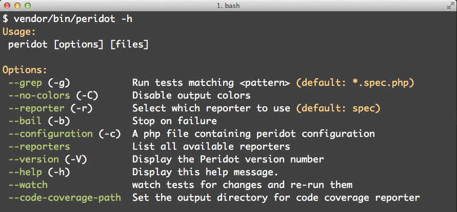

# Peridot Jumpstart

[![Current version image][version-image]][current version]

[current version]: https://packagist.org/packages/peridot-php/peridot-jumpstart
[version-image]: https://img.shields.io/packagist/v/peridot-php/peridot-jumpstart.svg?style=flat-square "This project uses semantic versioning"

Peridot core and some commonly used packages to let you start doing BDD in PHP
ASAP.

## Included plugins and libraries

* [List reporter] - list test results
* [Dot reporter] - show results as dot matrix
* [Code coverage reporters] - code coverage
* [Watcher plugin] - watch source and tests for changes and re-run
* [Concurrency plugin] - run specs concurrently!
* [Leo] - expressive assertion and matcher library

[code coverage reporters]: https://github.com/peridot-php/peridot-code-coverage-reporters
[concurrency plugin]: https://github.com/peridot-php/peridot-concurrency
[dot reporter]: https://github.com/peridot-php/peridot-dot-reporter
[leo]: https://github.com/peridot-php/leo
[list reporter]: https://github.com/peridot-php/peridot-list-reporter
[watcher plugin]: https://github.com/peridot-php/peridot-watcher-plugin

## Installing

We recommend installing the jumpstart via composer:

    $ composer require --dev peridot-php/peridot-jumpstart

## Getting started

After installing the jumpstart, a good starting point would be to copy this
package's `peridot.php` file into the root of your project. This file will
set the default path for specs, and ensure that all the included plugins are
registered.

If you installed the jumpstart via composer, you can follow up by doing this:

    $ cp vendor/peridot-php/peridot-jumpstart/peridot.php .

To set a different default path, disable a plugin, or set up further
configuration, simply edit your copy of `peridot.php`.

After registering everything, `vendor/bin/peridot -h` should yield the
following:

